# SentimentAI: AI Powered Sentiment Analyzer

A Flutter mobile application for sentiment analysis using Logistic Regression and Naive Bayes models trained on the IMDB dataset.


## Setup Instructions

### 1. Prepare the backend

This project has a simple Python/Flask backend located in the `backend/` folder. The frontend communicates with the server via a REST API.

1. **Create a Python virtual environment** (recommended):
   ```powershell
   cd backend
   python -m venv venv         # or `python3 -m venv venv`
   .\venv\Scripts\Activate   # Windows
   # source venv/bin/activate  # macOS/Linux
   ```

2. **Install Python dependencies:**
   ```powershell
   pip install -r requirements.txt
   ```

3. **Train or load models** (optional):
   - If you need to retrain the logistic regression / naive bayes models on the IMDB dataset, run:
     ```powershell
     python train_models.py
     ```
   - Trained model files will be saved as `logistic_model.pkl` and `nb_model.pkl`.
   - The `app.py` script will automatically load the models on startup.

4. **Start the server:**
   ```powershell
   python app.py
   ```
   By default the API listens on port `8000`. You can also use the provided `start_server.bat`.

5. **Verify the backend is running** by sending a test request:
   ```powershell
   curl -X POST http://localhost:8000/api/predict -H "Content-Type: application/json" -d '{"text":"test"}'
   ```
   You should receive a JSON response with predictions from both models.

### 2. Prepare the frontend (Flutter app)

#### Prerequisites

- Flutter SDK (3.0.0 or higher)
- Dart SDK (bundled with Flutter)
- Android Studio / VS Code with Flutter extensions
- Android emulator or physical device / iOS simulator

#### Installation

1. **Get Flutter packages:**
   ```bash
   flutter pub get
   ```

2. **Configure backend URL**

   Edit `lib/services/api_service.dart` and update the `_baseUrl` constant to point to your running server:
   ```dart
   // For local development (Android emulator):
   static const String _baseUrl = 'http://10.0.2.2:8000';

   // For iOS simulator:
   static const String _baseUrl = 'http://localhost:8000';

   // For physical device (replace with your machine's IP):
   static const String _baseUrl = 'http://192.168.1.XXX:8000';

   // For production (HTTPS):
   static const String _baseUrl = 'https://your-backend-domain.com';
   ```

3. **Run the app:**
   ```bash
   flutter run
   ```

The Flutter application will connect to the backend and display sentiment predictions.

### 3. Quick run summary

1. Navigate to `backend/` and set up Python env & install packages.
2. (Optional) run `python train_models.py` to regenerate model files.
3. Start the server with `python app.py` (or `start_server.bat`).
4. Open a terminal in the project root and run `flutter pub get`.
5. Configure `lib/services/api_service.dart` URL if necessary.
6. Launch the Flutter app (`flutter run`) on your target device or emulator.


## 📸 Output Screenshots

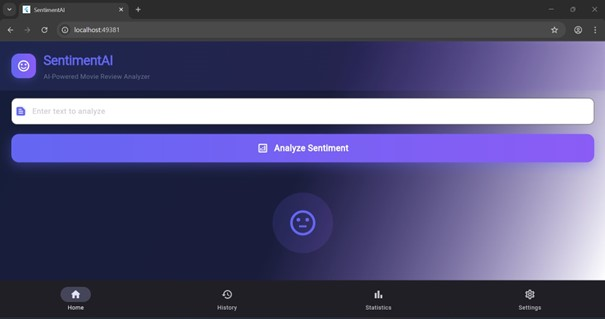
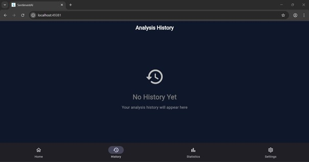
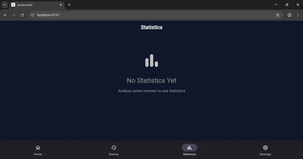
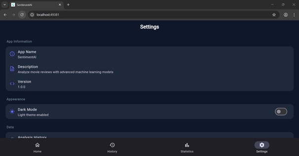
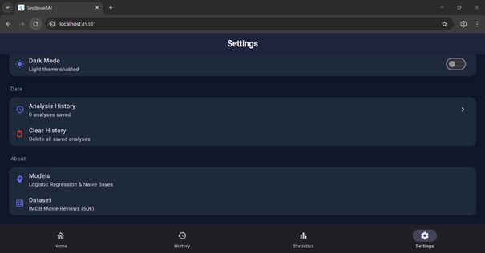

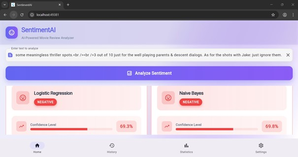
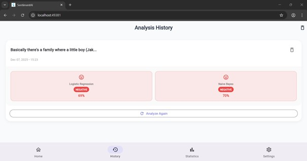
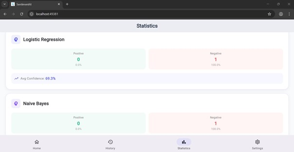
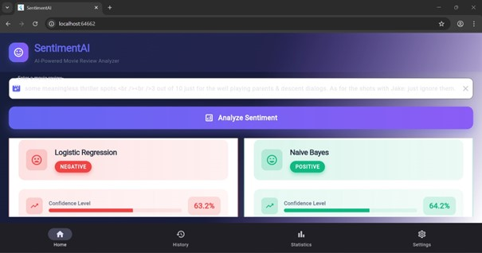
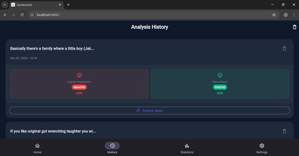
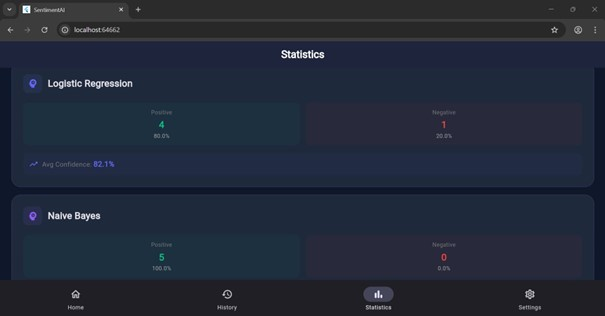
