# 🚀 SentimentAI: AI-Powered Sentiment Analyzer


A cross-platform Flutter mobile application that performs sentiment analysis on user input using Machine Learning models. The app uses **Logistic Regression** and **Naive Bayes**, trained on the IMDB dataset, and communicates with a Python Flask backend via REST APIs.

---

## ✨ Features

- 🔍 Real-time sentiment prediction (Positive / Negative)
- 🤖 Dual-model inference (Logistic Regression + Naive Bayes)
- 📱 Clean and responsive Flutter UI
- 🔗 REST API integration with Flask backend
- ⚡ Fast and lightweight predictions
- 🧠 Pre-trained ML models (with optional retraining)

---

## 🏗️ Project Architecture

```

Flutter App (Frontend)
↓
REST API (HTTP)
↓
Flask Backend (Python)
↓
ML Models (LR + NB)

````

---

## ⚙️ Backend Setup (Flask)

### 1. Create Virtual Environment

```bash
cd backend
python -m venv venv
````

Activate:

* **Windows**

```bash
.\venv\Scripts\activate
```

* **macOS/Linux**

```bash
source venv/bin/activate
```

---

### 2. Install Dependencies

```bash
pip install -r requirements.txt
```

---

### 3. Train Models (Optional)

```bash
python train_models.py
```

Outputs:

* `logistic_model.pkl`
* `nb_model.pkl`

---

### 4. Run Server

```bash
python app.py
```

Default:

```
http://localhost:8000
```

---

### 5. Test API

```bash
curl -X POST http://localhost:8000/api/predict \
-H "Content-Type: application/json" \
-d '{"text":"This movie is amazing!"}'
```

---

## 📱 Frontend Setup (Flutter)

### Prerequisites

* Flutter SDK (>= 3.0)
* Android Studio / VS Code
* Emulator or Physical Device

---

### 1. Install Packages

```bash
flutter pub get
```

---

### 2. Configure API URL

Edit:

```
lib/services/api_service.dart
```

```dart
// Android Emulator
static const String _baseUrl = 'http://10.0.2.2:8000';

// iOS Simulator
static const String _baseUrl = 'http://localhost:8000';

// Physical Device
static const String _baseUrl = 'http://192.168.1.XXX:8000';

// Production
static const String _baseUrl = 'https://your-backend-domain.com';
```

---

### 3. Run App

```bash
flutter run
```

---

## ⚡ Quick Start

```bash
# Backend
cd backend
python -m venv venv
venv\Scripts\activate
pip install -r requirements.txt
python app.py

# Frontend
flutter pub get
flutter run
```

---

## 📸 Screenshots

| Preview                   |
| ------------------------- |
| 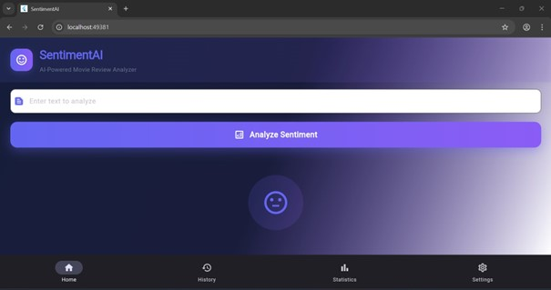  |
| 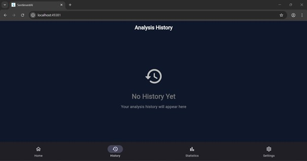  |
| 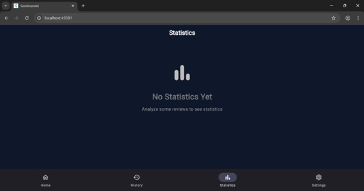  |
| 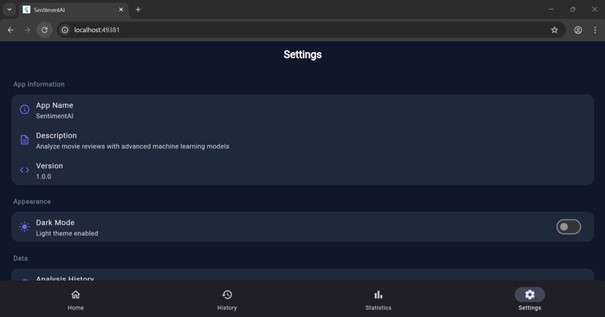  |
| 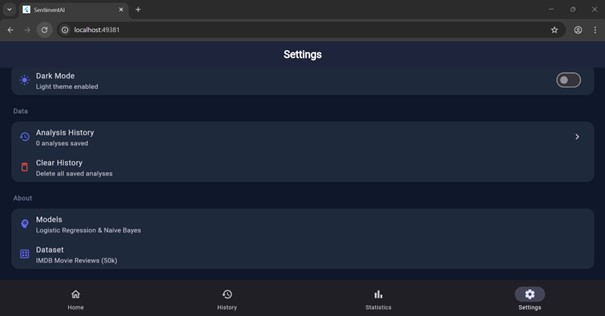  |
| 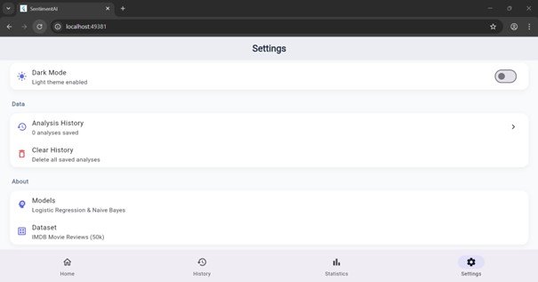  |
| 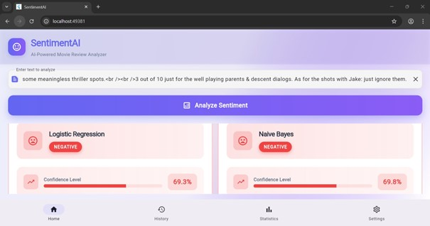  |
| 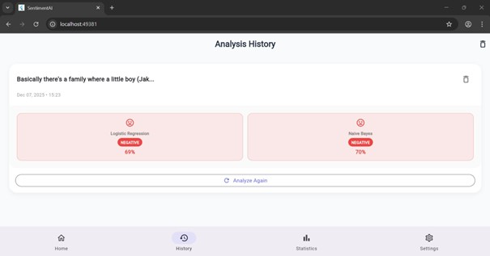  |
| 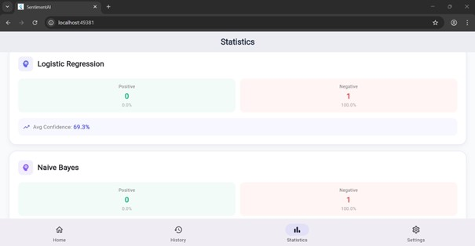  |
| 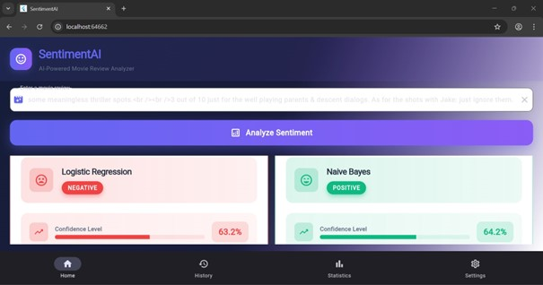 |
| 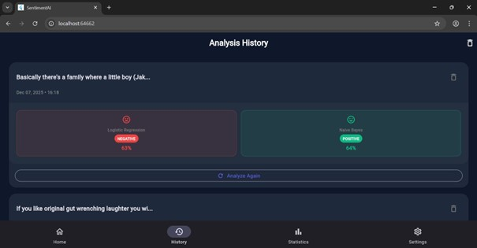 |
| 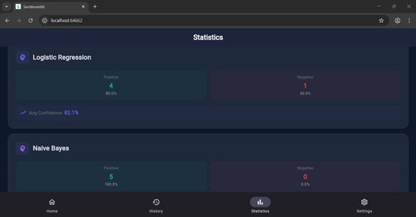 |

---

## 🧠 Tech Stack

* **Frontend:** Flutter (Dart)
* **Backend:** Flask (Python)
* **ML Models:**

  * Logistic Regression
  * Naive Bayes
* **Dataset:** IMDB Movie Reviews

---

## 📌 Future Improvements

* Deep Learning models (LSTM / BERT)
* Cloud deployment (AWS / Firebase / Render)
* Sentiment confidence score
* Better UI/UX animations
* Multi-language support

---

## 🤝 Contributing

Pull requests are welcome. For major changes, open an issue first.

---

## 📄 License

This project is licensed under the MIT License.

